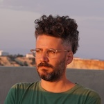

# Welcome to my profile
Here you will find a bit more about what I've done recently.

## About
I've been working with technology, design and arts for about 20 years. During this time, I've developed a multidisciplinary approach, going through the many steps involved in the conception and development of applications and digital interfaces.

## Tech stack
The following elements are part of my stack.

### Front-end
- HTML
- CSS / SASS
- React
- JS

### Back-end
- Mongodb
- PostgreSQL
- MySQL
- Python
- PHP

## More
[On this link you can check some of the projects I've been involved with.](http://www.nolab.com.br)
